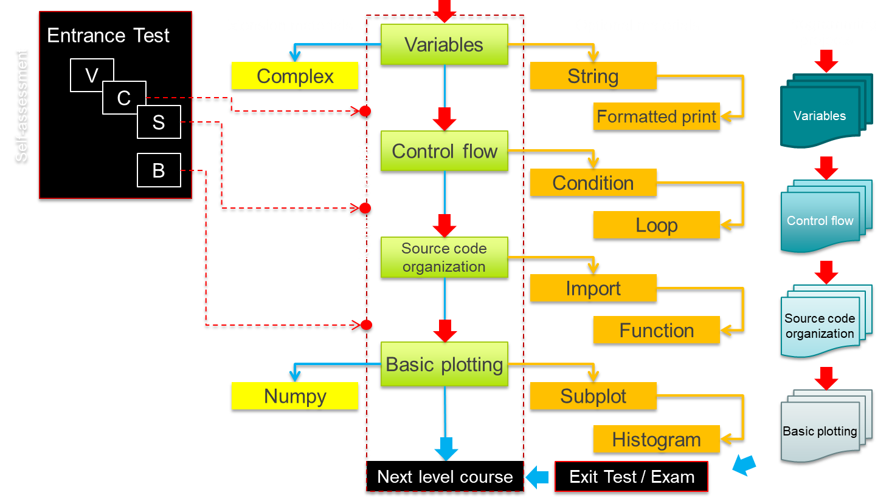
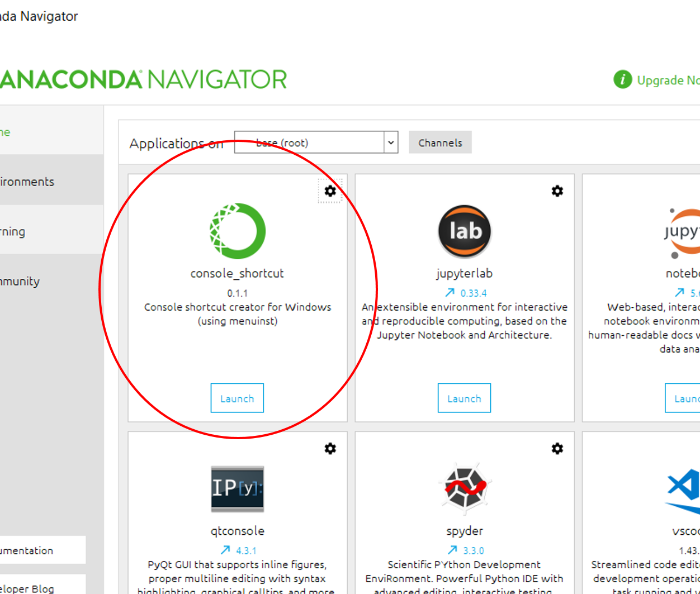

# Python Basic Programming -- Learning Materials

The **Python Basic Programming** course is a beginners course in Python programming. It assumes **no** prior programming skills. It teaches students -- ground up --basic Python programming skills, centered around *four* concepts:

1. [Variables](learning_materials/variables/README.md)

2. [Control Flow](learning_materials/control_flow/README.md)

3. [Code Organization](learning_materials/code_organization/README.md)

4. [Basic Plotting](learning_materials/basic_plotting/README.md)

The notebooks (the files with `.ipynb` extension) you'll find in this course are intended as **Learning Materials**; they demonstrate coding concepts and allow interactive experimenting by the student. A student can run code snippets shown in the materials *inside the same notebook*, and will thus be able to experiment with the Python code snippets -- *live* -- , thereby learning how the code works --*through interaction with the materials* -- .

In addition to the Learning Materials, there are **ProgrammingProjects** offering students a programming challenge to verify if concept just learned have been properly understood, and an **Entrance Test** to navigate already proficient students to their correct entry point into the course. Both ProgrammingProjects and Entrance Test will be discussed further down.

Back to the notebooks with the Learning Materials: technically speaking, the code is organized in the form of a **Jupyter Notebook**. A [Jypyter Notebook](http://Jupyter.org) is an interactive workbook, organized as a series of consecutive runnable *cells*. We use (clusters of) such cells to:

1. introduce *a new code concept*, or application of coding concept, in words (i.e. as text);

2. present a Python code snippet to demonstrate the concept or application. Code is *runnable*, producing *output*, and can be *modified by the student*, so as to learn all the details and study the effects of changes and variations. Experiments are usually announced in the notebook by a **DO THIS:** directive, prompting students for action

3. present overviews, diagrams, schemes, hints, remarks, etc. in a way that supports for easy lookup in experiments and later on

As stated, the notebooks in these materials contain Learning Materials. This is only a part of the entire collection of course materials. We will discuss the *remaining training materials* belonging to this course, below. To that end, the below diagram presents an overview.


*Overview of the Python Basic Programming course and its materials. The core of the course is contained in the dashed column. The red arrows indicate the intended flow of the core of the course, blue arrows indicate optional steps. Observe the correspondence between core Learning Materials, ProgrammingProjects, as well as between parts of the Entrance Test and entry points into the core course. Yellow boxes comprise extensional and optional Learning Materials*.

### Entrance tests
The Entrance Test is a series of *self-assessment tests* students can take to demonstrate they already master the basic programming concepts treated in the Python Basic Programming course. The programming background of students can vary significantly: some *freshmen* students already come in with programming skills. This Python Basic Programming course -- a *beginners course* -- will have little to offer to them. They can skip his course or do something more useful to them. The Entrance tests offers some triage tool and can thus help to handle this tremendous spread in background. The meaning attributed to the outcome of the test, is in the hands of the responsible teacher.

The Entrance test is commonly used to provide educated students more fitting entry points into the course. Like the Learning Materials, the corresponding Entrance Test has also been split in four parts; moreover, the exercises and questions in these four parts of the Entrance Test correspond one-to-one to the basic concepts in the four parts of the Learning Materials. So the first part of the Entrance Test would assess the understanding of variables, the next of control flow, etc. How does this work? An example:

**Example** <span style="color:skyblue; font-family: arial; font-size:.75em">
*A student already has worked with Python and knows about its basic concepts. To show evidence of this, the student made the Entrance Test and had his or her grades recorded in Brightspace. All test results were good, but not the __Matplotlib basic plotting__ tests (the __B__ part), the last series of test exercises in the whole Entrance Test. It would thus be sufficient for the student to just do the __Basic Plotting__ part of the core course. Consequently, the first three notebooks in the core course might be skipped and the student would start right with the final Notebook about Basic Plotting. As seen fit, the student might want to do one of the additional notebooks available, for instance the one on using advanced string formatting (not belonging to the core materials of the Python Basic Programming course).*
</span>

### Programming Projects
Also belonging to this course, are Programming Projects. Their goal is to educate students in tackling a bigger problem in a programming project completely by themselves, assessing the set out learning goals of the course. Sometimes, doing a student programming project is a part of an ever bigger project, like the Ontwerpwedstrijd at Mechanical Engineering, or the Grand Challenges for Applied Earth Sciences students. In this case, the faculty will generally dictate the subject of the Programming Project.

However, the Python Basic Programming Course also comes with several generally applicable programming projects for students, which can be used in case there is not already an embedding project like the ones mentioned above. Programming projects offered, can optionally be guided by a python-skeleton for a solution and/or be autograded for a grade. Teachers can specify what suites best for their student population.

For each of the four concepts presented in the beginning, one or more ProgrammingProjects are available, and more ProgrammingProjects are expected to arrive in the future. Each individual ProgrammingProject builds upon the programming knowledge students have acquired up till that stage. To exemplify: ProgrammingProjects coming with Basic Plotting -- being the last stage --, assume all concepts treated in this course to be mastered by the student.

### Exit Test (Exam)
At the end of the course, a formative or summative check, test or exam may be inserted, assessing as to whether all learning goals have been accomplished. This has been entered in the above diagram by a box *Exit Test*. The Exit Test is a counterpart of the Entrance Test, and could even be the same test. In both tests (or exam), students demonstrate the skills acquired to comply with the learning goals. Like is the case with the Entrance Test, Exit Tests (Exams) are typically **autograded**, which implies that the work by the students is assessed digitally and graded by an application that is also part of what this course has to offer.

Autograding cuts down the grading effort dramatically. Autograding assessments are developed along with the materials, and can assess (formative or summative) end results, as well as intermediate results and even the way in which the results have been achieved by the student code, up to a certain extent. The [Vocareum cloud platform](https://www.vocareum.com/) available in connection with BrightSpace offers autograding as one of the services, by offering a [JupyterHub](https://jupyter.org/hub) implementation.

Typically, for first year "freshmen" students, Entrance Test, Learning Materials, Programming Projects, and an Exit Test are used in concert. The details are to be decided upon by the Faculties.   

## Anaconda platform
[Anaconda](http://www.anaconda.com/distribution/) is an open source platform, offering (among others):
* [Anaconda](http://www.anaconda.com/distribution), [Miniconda](https://docs.conda.io/en/latest/miniconda.html)
* [python3](http://python.org)
* [Spyder](https://www.spyder-ide.org/), [Idle](https://docs.python.org/3/library/idle.html)
* [R](https://www.r-project.org/), [R Studio](https://rstudio.com/products/rstudio/)
* [Numpy/SciPy](http://scipy.org)
* Matplotlib, plotly, Seaborn, ggplot, bokeh, [...](https://docs.anaconda.com/ae-notebooks/user-guide/adv-tasks/use-visualization-pkgs/)
* [PyTorch](https://pytorch.org/)
* TensorFlow, SciKit Learn, ...
* Dask, Holoviews, ...
* [Visual Studio Code](https://code.visualstudio.com/), [PyCharm](https://www.jetbrains.com/pycharm/promo/anaconda/) for Anaconda installers

and many other packages preinstalled. Anaconda installers are available for Windows, Mac, and various distributions of Linux.

The 2020 Central TUD Software repository Anaconda version will be based on python 3.7.6, while support for python2 will be dropped.

## Coding style
Whenever possible, we follow the [PEP-8 Coding Standard and Python Style Guide](https://www.python.org/dev/peps/pep-0008/).

## For the teacher: how to run this course?
Courses can be one of:
* Optional course, no testing, no or formative grading, no exam
* Mandatory course for all students, concluded by an exam
* Lab course, TA-supported, sufficient Programming Project result
* Embedded course, embedded in a bigger project, giving a check-off or partial grade

Typical workflow:

* install a platform to run the course on:
  * have students install **Anaconda** from the [Central TUD Software Repository](http://software.udelft.nl); this software comes with a self-explaining installer packed with it
  * use a server platform, such as [JupyterHub](https://jupyter.org/hub), or a local Jupyter server,
  or a [cloud plaform such as Vocareum](https://www.vocareum.com/2019/02/09/jupyter-transformation/)
* make the learning materials available (i.e. publish them):
  * within your course on Brightspace (e.g. as a zipped archive student can unpack and install on their laptop)
  * from one of the [university servers](https://webdata.tudelft.nl/)
  * over [Vocareum cloud platform](https://www.vocareum.com/#campus)
  * from [Gitlab](http://gitlab.tudelft.nl)
* once unpacked, student load the course materials in the Jupyter Notebooks App, JupyterLab, or [PyCharm](https://www.jetbrains.com/pycharm/promo/anaconda/) or anything else to run a Notebook. Anaconda provides full-featured Jupyter Notebook environments
* organize TA's (Teaching Assistants) to assist your students with their programming tasks and answer technical questions they may have
* if your course includes an entrance test, inform your students about the option of taking an entrance test at the start of the course, if they believe that they already do satisfy the learning goals set out for (parts of) this course. This communication is best embedded in Brightspace course communication. A ready to copy Brightspace solution is available and can be made available to you
* if your course includes a programming project, distribute your programming project like the materials, in one of the ways described above
* if your course includes an exam, prepare the exam with or without autograding and (in the case of a digital exam) apply for the [procedure of a digital exam in the digital examination environment](https://intranet.tudelft.nl/-/digital-examinations). This environment is Anaconda-ready and prepared for handling autograded exams. Technical assistance can be provided to you as part of this course
* collect grades in Brightspace and from Brightspace, export final grades to OSIRIS

## For the student: how to start?

### Preparations for students
You either:
* have [Anaconda](http://www.anaconda.com/distribution/) installed on your computer (we assume you installed the standardized version, to be obtained freely from the [Central TUD software repository](http://software.tudelft.nl) ), or:
* acquire access to a TU Delft Anaconda-running platform like Vocareum; access is commonly through Brightspace access (single-sign-on)

NOTES:
* Anaconda can easily be installed, from multiple online sources. But **all DigitalSkills materials**, and also the **digital exam environment** have been developed based on the TUD standardized installation of Anaconda. For your convenience, the [TUD standardized Anaconda](http://software.tudelft.nl) comes with an easy to us installer
* materials installed this way have a TU Delft styling
* Anaconda as installed from the [Central TUD software repository](http://software.tudelft.nl) includes all software you need, also Jupyter Notebook, JupyterLab, Spyder, Matplotlib, and all other tools you need. It also prepares a **Anaconda Prompt** (or `cmd.exe` Command terminal or Powershell, a `terminal`, `bash` or any other fitting shell on your platform) for you, which can be accessed from the Start Menu or form the Anaconda Navigator GUI, and which can be used to launch any of the Anaconda tools from the command line or in a shell script.

### Opening the first Notebook
If you never worked with Jupyter Notebooks before, [start here](https://jupyter-notebook-beginner-guide.readthedocs.io/en/latest/what_is_jupyter.html) . If you know what a notebook is, but just need to freshen up, [start here](https://jupyter-notebook-beginner-guide.readthedocs.io/en/latest/execute.html)] . We repeat the most important steps below.

Here, for demo purposes, we assume:

  - You started a **Anaconda Prompt** command shell (see image below)
  - The notebooks with the learning materials are in a folder: `digitalskills`, and in subdirectories of that folder


*Launching an Anaconda Prompt shell from the Anaconda Navigator GUI. Alternative: Search for `Anaconda` under __Start__ in your Windows Task Bar, or equivalent on other platforms*.

Then to open your *first Notebook on variables* as follows (`$` is just a prompt, don't type it yourself):

```bash
$ cd /path/to/digitalskills/python-basic-programming/
$ jupyter notebook --notebook-dir .
```

mind the last `.` (period for: current directory). This will take you into the Jupyter Notebook App, with the `Files` Tab active. Now, navigate into the `variables` folder, and click on the `PythonBasicProgramming_20.ipynb` Notebook, to open it. Follow further instructions in the notebook text.

### Troubleshooting
* Problem: your computer cannot find `jupyter` but you're sure it has been preinstalled
  Solution: check if your `jupyter` app is in the path. You may try to locate it by searching from the Start menu in the Task bar. Alternatively, search for **Environment Variables** in the Search under the Start in the Task Bar. Adjust the PATH settings so that the `jupyter` application can be found. After adjusting, check in an Anaconda Prompt shell:

```bash
$ jupyter --version
```

again, the `$` is the shell prompt, don't key it in. If `jupyter` is now in your path, it should respond like in:

```shell
(miniconda3) PS C:\Users\...> jupyter --version
jupyter core     : 4.6.1
jupyter-notebook : 6.0.3
qtconsole        : 4.6.0
ipython          : 7.12.0
ipykernel        : 5.1.4
jupyter client   : 5.3.4
jupyter lab      : not installed
nbconvert        : 5.6.1
ipywidgets       : 7.5.1
nbformat         : 5.0.4
traitlets        : 4.3.3
(miniconda3) PS C:\Users\...>
```

(version numbers may diverge from the above ones).

* Problem: your notebook opens, but doesn't want to execute the code
  Solution: check in the top right corner of your notebook whether there is a warning **[No kernel]**. You may check this again in the Command with Anaconda shell, typing:

  ```sh
  $ jupyter kernelspec list
  ```

  you should see something like:

  ```sh
  Available kernels:
    ...
    python3   C:\Users\...\jupyter\kernels\python3
  PS C:\Users\bhmgerritsen>    
  ```

  If `python3` is not in this list, it might be missing or not installed properly. That being the case, ask an assistant to help you install a Python3 kernel, or repair this yourself, looking [here](https://ipython.readthedocs.io/en/latest/install/kernel_install.html)

* Problem: you're experiencing configuration problems (i.e., not seeing any data, image, settings ...) or cannot find kernelspecs
    Solution: check the location `jupyter` is looking for configuration items. In `Anaconda Prompt` do this:

    ```sh
    $ jupyter --paths
    ```

    you see something like:

    ```sh
    C:\Users\...\notebooks> jupyter --paths
    config:
        C:\Users\bhmgerritsen\.jupyter
        C:\ProgramData\Anaconda3\etc\jupyter
        C:\ProgramData\jupyter
    data:
        C:\Users\bhmgerritsen\AppData\Roaming\jupyter
        C:\ProgramData\Anaconda3\share\jupyter
        C:\ProgramData\jupyter
    runtime:
        C:\Users\bhmgerritsen\AppData\Roaming\jupyter\runtime
    (Anaconda3) PS >
    ```
* Problem: you ran the code in the notebook, but at the bottom, you accidentally made an extra cell that you want to remove again
  Solution: choose: select the cell to remove by pressing the left mouse button when over the cell, then: `Edit->Cut Cells`. Alternatively, in the Jupyter Notebook menu at the top, in the button bar, there is a button with a scissors. Select the cell to delete and press this scissors button.  
